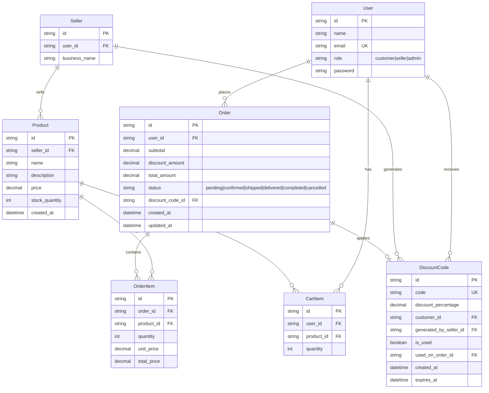

# E-Commerce Backend API Design Plan (Updated)

## Table of Contents
1. [Tech Stack](#tech-stack)
2. [Refined Understanding](#refined-understanding)
3. [Data Flow Architecture](#data-flow-architecture)
4. [Entity Relationship Diagram](#entity-relationship-diagram)
5. [Static Users Configuration](#static-users-configuration)
6. [API Design](#api-design)
   - [Authentication APIs](#authentication-apis)
   - [Customer APIs](#customer-apis)
   - [Seller APIs](#seller-apis)
   - [Admin APIs](#admin-apis)
7. [In-Memory Data Store Structure](#in-memory-data-store-structure)
8. [Request/Response Structures](#requestresponse-structures)
9. [Implementation Todo List](#implementation-todo-list)

---

## Tech Stack

### Backend Framework
- **NestJS** (v10+) - Progressive Node.js framework for building efficient, reliable, and scalable server-side applications
- **TypeScript** - Primary language for type-safe development

### Core Dependencies
- **@nestjs/common** - NestJS core utilities
- **@nestjs/core** - NestJS core functionality
- **@nestjs/platform-express** - Express platform adapter
- **@nestjs/swagger** - Swagger/OpenAPI integration for API documentation
- **@nestjs/jwt** - JWT authentication utilities
- **@nestjs/passport** - Passport.js integration for authentication
- **passport-jwt** - JWT strategy for Passport

### Development Tools
- **@nestjs/cli** - NestJS CLI for project scaffolding
- **typescript** - TypeScript compiler
- **ts-node** - TypeScript execution environment
- **nodemon** - Development auto-reload

### Data Storage
- **In-Memory Storage** - Maps for O(1) lookups (no database required)

### API Documentation
- **Swagger UI** - Interactive API documentation at `/api-docs`
- **OpenAPI 3.0** specification auto-generated from decorators

### Project Structure (NestJS Modules)
```
src/
├── auth/              # Authentication module (login, JWT)
├── users/             # Users module (static users)
├── products/          # Products module
├── cart/              # Shopping cart module
├── orders/            # Orders module
├── discounts/         # Discount codes module
├── analytics/         # Analytics module (admin/seller)
├── config/            # Store configuration module
├── common/            # Guards, decorators, utilities
├── store/             # In-memory data store
└── main.ts            # Application entry point
```

---

## Refined Understanding

### Key Business Rules (UPDATED)

1. **Static Users Only (No Registration)**:
   - 2 Customers: `customer1`, `customer2`
   - 2 Sellers: `seller1`, `seller2`
   - 1 Admin: `admin1`
   - All pre-created, no user registration API

2. **Authentication**:
   - JWT-based authentication
   - Login endpoint returns JWT token
   - All API requests require `Authorization: Bearer <token>` header
   - Token contains userId and role for authorization

3. **Discount System (Seller-Managed)**:
   - **Seller** generates discount codes for their customers
   - Every **n orders** (configurable by **admin**, default: 3) completed by a customer triggers auto-generation
   - Discount percentage: **10%** (configurable by **admin**)
   - **User-specific**: Only the customer who earned it can use the code
   - **Single-use**: Once used on ANY order (pending/shipped/completed/cancelled), the code expires immediately
   - **Expiration date**: Set by the seller when generating

4. **Order Status Flow**:
   - Starts as "pending"
   - Only **sellers** can change status (not admin)
   - Statuses: pending → confirmed → shipped → delivered → completed
   - When status becomes "completed", check if discount code should be auto-generated

5. **Discount Code Usage Rule**:
   - Once a discount code is applied to an order (regardless of order status), it becomes unusable
   - The code is permanently attached to that order

6. **Reporting**:
   - Per seller analytics (seller views their own)
   - Store-wide analytics (admin views all)

---

## Data Flow Architecture

### Request-Response Flow

```
┌─────────────────────────────────────────────────────────────────────┐
│                         CLIENT REQUEST                              │
│  POST /api/auth/login                                               │
│  { userId: "customer1", password: "password123" }                   │
└─────────────────────────────────────────────────────────────────────┘
                                    │
                                    ▼
┌─────────────────────────────────────────────────────────────────────┐
│                      AUTH CONTROLLER                                │
│  - Validates credentials                                            │
│  - Generates JWT token                                              │
│  - Returns token + user info                                        │
└─────────────────────────────────────────────────────────────────────┘
                                    │
                                    ▼
┌─────────────────────────────────────────────────────────────────────┐
│                   SUBSEQUENT REQUESTS                               │
│  GET /api/products                                                  │
│  Headers: Authorization: Bearer <token>                             │
└─────────────────────────────────────────────────────────────────────┘
                                    │
                                    ▼
┌─────────────────────────────────────────────────────────────────────┐
│                      JWT AUTH GUARD                                 │
│  - Extracts token from header                                       │
│  - Verifies token signature                                         │
│  - Attaches user to request context                                 │
└─────────────────────────────────────────────────────────────────────┘
                                    │
                                    ▼
┌─────────────────────────────────────────────────────────────────────┐
│                      ROLES GUARD                                    │
│  - Checks if user role matches required roles                       │
│  - Returns 403 if unauthorized                                      │
└─────────────────────────────────────────────────────────────────────┘
                                    │
                                    ▼
┌─────────────────────────────────────────────────────────────────────┐
│                     CONTROLLER METHOD                               │
│  - Validates input DTO                                              │
│  - Calls service layer                                              │
└─────────────────────────────────────────────────────────────────────┘
                                    │
                                    ▼
┌─────────────────────────────────────────────────────────────────────┐
│                      SERVICE LAYER                                  │
│  - Business logic                                                   │
│  - Interacts with in-memory Store                                   │
└─────────────────────────────────────────────────────────────────────┘
                                    │
                                    ▼
┌─────────────────────────────────────────────────────────────────────┐
│                    IN-MEMORY STORE                                  │
│  - Maps for users, products, carts, orders, discountCodes           │
│  - Static 5 users pre-loaded                                        │
└─────────────────────────────────────────────────────────────────────┘
```

### Checkout Flow with Discount

```
Customer Action: POST /api/orders/checkout
                          │
                          ▼
           ┌──────────────────────────────┐
           │  1. Validate JWT & Get User  │
           └──────────────────────────────┘
                          │
                          ▼
           ┌──────────────────────────────┐
           │  2. Get Cart from In-Memory  │
           │     Store (userId -> Cart[]) │
           └──────────────────────────────┘
                          │
                          ▼
           ┌──────────────────────────────┐
           │  3. Validate Stock for Each  │
           │     Product in Cart          │
           └──────────────────────────────┘
                          │
                          ▼
           ┌──────────────────────────────┐
           │  4. Calculate Subtotal       │
           │     sum(product.price * qty) │
           └──────────────────────────────┘
                          │
                          ▼
           ┌──────────────────────────────┐
           │  5. If Discount Code:        │
           │     - Check code exists      │
           │     - Verify customer owns it│
           │     - Check not expired      │
           │     - Check not already used │
           └──────────────────────────────┘
                          │
                          ▼
           ┌──────────────────────────────┐
           │  6. Apply Discount           │
           │     discountAmount =         │
           │       subtotal * % / 100     │
           └──────────────────────────────┘
                          │
                          ▼
           ┌──────────────────────────────┐
           │  7. Deduct Stock from        │
           │     Products                 │
           └──────────────────────────────┘
                          │
                          ▼
           ┌──────────────────────────────┐
           │  8. Create Order +           │
           │     OrderItems               │
           └──────────────────────────────┘
                          │
                          ▼
           ┌──────────────────────────────┐
           │  9. If Discount Used:        │
           │     Mark code as used        │
           │     Link to order            │
           └──────────────────────────────┘
                          │
                          ▼
           ┌──────────────────────────────┐
           │  10. Clear Cart              │
           └──────────────────────────────┘
                          │
                          ▼
           ┌──────────────────────────────┐
           │  11. Return Order Response   │
           └──────────────────────────────┘
```

### Auto Discount Generation Flow

```
Seller Action: PUT /api/seller/orders/{id}/status
               Body: { status: "completed" }
                          │
                          ▼
           ┌──────────────────────────────┐
           │  1. Validate JWT (Seller)    │
           └──────────────────────────────┘
                          │
                          ▼
           ┌──────────────────────────────┐
           │  2. Update Order Status      │
           └──────────────────────────────┘
                          │
                          ▼
           ┌──────────────────────────────┐
           │  3. If Status = "completed": │
           │     Count customer's         │
           │     completed orders         │
           └──────────────────────────────┘
                          │
                          ▼
           ┌──────────────────────────────┐
           │  4. Get Config: n value      │
           │     (default = 3)            │
           └──────────────────────────────┘
                          │
                          ▼
           ┌──────────────────────────────┐
           │  5. If count % n === 0:      │
           │     Generate Discount Code   │
           └──────────────────────────────┘
                          │
                          ▼
           ┌──────────────────────────────┐
           │  6. Return Response with     │
           │     Generated Code           │
           └──────────────────────────────┘
```

---

## Static Users Configuration

These 5 users are pre-created in the system:

| User ID | Name | Email | Role | Password |
|---------|------|-------|------|----------|
| `customer1` | Customer One | customer1@store.com | customer | password123 |
| `customer2` | Customer Two | customer2@store.com | customer | password123 |
| `seller1` | Seller One | seller1@store.com | seller | password123 |
| `seller2` | Seller Two | seller2@store.com | seller | password123 |
| `admin1` | Admin One | admin1@store.com | admin | password123 |

### JWT Token Structure
```json
{
  "userId": "customer1",
  "role": "customer",
  "iat": 1706947200,
  "exp": 1707033600
}
```

---

## Entity Relationship Diagram

### Mermaid ERD Diagram



### Entity Descriptions

| Entity | Description |
|--------|-------------|
| **User** | Pre-created users (5 static: 2 customers, 2 sellers, 1 admin) |
| **Product** | Items sold by sellers |
| **CartItem** | In-memory cart storage per user |
| **Order** | Purchase orders with discount tracking |
| **OrderItem** | Individual items in an order |
| **DiscountCode** | User-specific codes generated by sellers |
| **StoreConfig** | Admin-configurable settings (n value, discount %) |

---

## API Design

### Authentication APIs

#### 1. Login
```
POST /api/auth/login
```
Authenticates user and returns JWT token.

**Request:**
```json
{
  "userId": "customer1",
  "password": "password123"
}
```

**Response:**
```json
{
  "success": true,
  "token": "eyJhbGciOiJIUzI1NiIsInR5cCI6IkpXVCJ9...",
  "user": {
    "id": "customer1",
    "name": "Customer One",
    "role": "customer"
  }
}
```

---

### Customer APIs (Require JWT Token)

All customer APIs require: `Authorization: Bearer <token>`

#### 1. View Products
```
GET /api/products
```
Returns list of all available products.

#### 2. Add Item to Cart
```
POST /api/cart/add
```
Adds a product to the user's cart.

**Request:**
```json
{
  "productId": "prod-001",
  "quantity": 2
}
```

#### 3. View Cart
```
GET /api/cart
```
Returns current cart items with totals.

#### 4. Remove from Cart
```
DELETE /api/cart/:productId
```
Removes item from cart.

#### 5. Checkout
```
POST /api/orders/checkout
```
Places order with optional discount code.

**Request:**
```json
{
  "discountCode": "SAVE10-ABC123" // optional
}
```

**Validation Rules:**
- Discount code must belong to the logged-in customer
- Discount code must not be already used
- Discount code must not be expired

#### 6. View My Orders
```
GET /api/orders
```
Returns customer's order history with discount details.

#### 7. View My Available Discount Codes
```
GET /api/discounts
```
Returns unused, non-expired discount codes for the logged-in customer.

---

### Seller APIs (Require JWT Token + Seller Role)

All seller APIs require: `Authorization: Bearer <token>` and seller role.

#### 1. Create Product
```
POST /api/seller/products
```
Creates a new product for this seller.

#### 2. Update Product
```
PUT /api/seller/products/:productId
```
Updates seller's product details.

#### 3. Delete Product
```
DELETE /api/seller/products/:productId
```
Removes seller's product.

#### 4. View My Products
```
GET /api/seller/products
```
Returns all products created by this seller.

#### 5. View Orders for My Products
```
GET /api/seller/orders
```
Returns orders containing this seller's products.

#### 6. Update Order Status
```
PUT /api/seller/orders/:orderId/status
```
Updates order status.

**Request:**
```json
{
  "status": "completed"
}
```

**Auto-Discount Generation:**
- When status changes to "completed"
- Count customer's completed orders
- If count % n === 0, auto-generate discount code for that customer
- Discount code format: `DISCOUNT-{userId}-{timestamp}`

#### 7. Generate Manual Discount Code
```
POST /api/seller/discounts/generate
```
Manually generate a discount code for a specific customer.

**Request:**
```json
{
  "customerId": "customer1",
  "expiresAt": "2026-03-03T00:00:00Z"
}
```

**Response:**
```json
{
  "success": true,
  "discountCode": {
    "code": "SAVE10-ABC123",
    "discountPercentage": 10,
    "customerId": "customer1",
    "expiresAt": "2026-03-03T00:00:00Z",
    "isUsed": false
  }
}
```

#### 8. View My Discount Codes
```
GET /api/seller/discounts
```
Returns all discount codes generated by this seller.

#### 9. View Seller Analytics
```
GET /api/seller/analytics
```
Returns seller-specific metrics.

---

### Admin APIs (Require JWT Token + Admin Role)

All admin APIs require: `Authorization: Bearer <token>` and admin role.

#### 1. Configure Store Settings
```
PUT /api/admin/config
```
Configure global store settings.

**Request:**
```json
{
  "discountNValue": 3,        // Every nth order gets discount
  "discountPercentage": 10    // Discount percentage
}
```

#### 2. View Store Analytics
```
GET /api/admin/analytics
Query: ?startDate&endDate (optional)
```
Returns store-wide metrics.

**Response:**
```json
{
  "success": true,
  "data": {
    "storeWide": {
      "totalCustomers": 2,
      "totalSellers": 2,
      "totalProducts": 10,
      "totalOrders": 25,
      "totalItemsPurchased": 50,
      "totalRevenue": 45000,
      "totalDiscountCodesGenerated": 8,
      "totalDiscountsGiven": 1200,
      "discountNValue": 3,
      "discountPercentage": 10
    },
    "perSeller": [
      {
        "sellerId": "seller1",
        "sellerName": "Seller One",
        "productsCount": 5,
        "ordersCount": 15,
        "itemsSold": 30,
        "revenue": 25000
      }
    ]
  }
}
```

#### 3. List All Discount Codes
```
GET /api/admin/discounts
```
Returns all discount codes in the system.

#### 4. List All Orders
```
GET /api/admin/orders
```
Returns all orders in the system.

---

## In-Memory Data Store Structure

### TypeScript Interfaces

```typescript
interface InMemoryStore {
  // Static users (pre-created)
  users: Map<string, User>;
  
  // Dynamic data
  products: Map<string, Product>;
  carts: Map<string, CartItem[]>; // userId -> CartItem[]
  orders: Map<string, Order>;
  orderItems: Map<string, OrderItem[]>; // orderId -> OrderItem[]
  discountCodes: Map<string, DiscountCode>;
  
  // Admin configuration
  storeConfig: {
    discountNValue: number;    // default: 3
    discountPercentage: number; // default: 10
  };
  
  // Helper counters for IDs
  counters: {
    product: number;
    order: number;
    discountCode: number;
    cartItem: number;
    orderItem: number;
  };
}

interface User {
  id: string;           // customer1, customer2, seller1, seller2, admin1
  name: string;
  email: string;
  role: 'customer' | 'seller' | 'admin';
  password: string;     // hashed or plain for demo
}

interface Product {
  id: string;
  sellerId: string;
  name: string;
  description: string;
  price: number;
  stockQuantity: number;
  createdAt: Date;
}

interface CartItem {
  id: string;
  userId: string;
  productId: string;
  quantity: number;
}

interface Order {
  id: string;
  userId: string;
  subtotal: number;
  discountAmount: number;
  totalAmount: number;
  status: 'pending' | 'confirmed' | 'shipped' | 'delivered' | 'completed' | 'cancelled';
  discountCodeId?: string;  // References the used discount code
  createdAt: Date;
  updatedAt: Date;
}

interface OrderItem {
  id: string;
  orderId: string;
  productId: string;
  quantity: number;
  unitPrice: number;
  totalPrice: number;
}

interface DiscountCode {
  id: string;
  code: string;                    // e.g., "SAVE10-ABC123"
  discountPercentage: number;      // e.g., 10
  customerId: string;              // The user who can use this code
  generatedBySellerId: string;     // The seller who generated it
  isUsed: boolean;
  usedOnOrderId?: string;          // The order that used this code
  createdAt: Date;
  expiresAt: Date;
}

// JWT Secret for token signing
const JWT_SECRET = 'your-secret-key';
```

### Initial Data Seeding

```typescript
// Initialize store with static users
function initializeStore(): InMemoryStore {
  const store: InMemoryStore = {
    users: new Map(),
    products: new Map(),
    carts: new Map(),
    orders: new Map(),
    orderItems: new Map(),
    discountCodes: new Map(),
    storeConfig: {
      discountNValue: 3,
      discountPercentage: 10
    },
    counters: {
      product: 0,
      order: 0,
      discountCode: 0,
      cartItem: 0,
      orderItem: 0
    }
  };

  // Seed static users
  const users: User[] = [
    { id: 'customer1', name: 'Customer One', email: 'customer1@store.com', role: 'customer', password: 'password123' },
    { id: 'customer2', name: 'Customer Two', email: 'customer2@store.com', role: 'customer', password: 'password123' },
    { id: 'seller1', name: 'Seller One', email: 'seller1@store.com', role: 'seller', password: 'password123' },
    { id: 'seller2', name: 'Seller Two', email: 'seller2@store.com', role: 'seller', password: 'password123' },
    { id: 'admin1', name: 'Admin One', email: 'admin1@store.com', role: 'admin', password: 'password123' }
  ];

  users.forEach(user => store.users.set(user.id, user));

  return store;
}
```

---

## Request/Response Structures

### Authentication

#### POST /api/auth/login
**Request:**
```json
{
  "userId": "customer1",
  "password": "password123"
}
```

**Response (200 OK):**
```json
{
  "success": true,
  "message": "Login successful",
  "token": "eyJhbGciOiJIUzI1NiIsInR5cCI6IkpXVCJ9...",
  "user": {
    "id": "customer1",
    "name": "Customer One",
    "email": "customer1@store.com",
    "role": "customer"
  }
}
```

**Response (401 Unauthorized):**
```json
{
  "success": false,
  "message": "Invalid credentials"
}
```

---

### Customer APIs

#### POST /api/cart/add
**Headers:** `Authorization: Bearer <token>`

**Request:**
```json
{
  "productId": "prod-001",
  "quantity": 2
}
```

**Response (200 OK):**
```json
{
  "success": true,
  "message": "Item added to cart",
  "cart": {
    "items": [
      {
        "id": "cart-1",
        "productId": "prod-001",
        "productName": "Laptop",
        "quantity": 2,
        "unitPrice": 1000,
        "totalPrice": 2000
      }
    ],
    "totalItems": 2,
    "subtotal": 2000
  }
}
```

#### POST /api/orders/checkout
**Headers:** `Authorization: Bearer <token>`

**Request:**
```json
{
  "discountCode": "SAVE10-ABC123" // optional
}
```

**Response (201 Created - With Valid Discount):**
```json
{
  "success": true,
  "message": "Order placed successfully",
  "order": {
    "id": "order-001",
    "items": [
      {
        "productId": "prod-001",
        "productName": "Laptop",
        "quantity": 2,
        "unitPrice": 1000,
        "totalPrice": 2000
      }
    ],
    "subtotal": 2000,
    "discountAmount": 200,
    "totalAmount": 1800,
    "status": "pending",
    "appliedDiscountCode": "SAVE10-ABC123",
    "createdAt": "2026-02-03T10:00:00Z"
  }
}
```

**Response (400 Bad Request - Invalid Discount):**
```json
{
  "success": false,
  "message": "Invalid discount code: Code has already been used"
}
```

**Response (400 Bad Request - Expired Discount):**
```json
{
  "success": false,
  "message": "Invalid discount code: Code has expired"
}
```

**Response (403 Forbidden - Not Owner):**
```json
{
  "success": false,
  "message": "Invalid discount code: This code is not assigned to you"
}
```

#### GET /api/discounts
**Headers:** `Authorization: Bearer <token>`

**Response (200 OK):**
```json
{
  "success": true,
  "discountCodes": [
    {
      "code": "SAVE10-ABC123",
      "discountPercentage": 10,
      "expiresAt": "2026-03-03T00:00:00Z",
      "isUsed": false
    },
    {
      "code": "SAVE10-DEF456",
      "discountPercentage": 10,
      "expiresAt": "2026-03-15T00:00:00Z",
      "isUsed": false
    }
  ]
}
```

---

### Seller APIs

#### PUT /api/seller/orders/:orderId/status
**Headers:** `Authorization: Bearer <token>`

**Request:**
```json
{
  "status": "completed"
}
```

**Response (200 OK - With Auto-Generated Discount):**
```json
{
  "success": true,
  "message": "Order status updated to completed",
  "order": {
    "id": "order-001",
    "status": "completed",
    "updatedAt": "2026-02-03T10:30:00Z"
  },
  "discountGenerated": {
    "code": "SAVE10-XYZ789",
    "discountPercentage": 10,
    "customerId": "customer1",
    "expiresAt": "2026-03-03T10:30:00Z"
  }
}
```

**Response (200 OK - No Discount Generated):**
```json
{
  "success": true,
  "message": "Order status updated to completed",
  "order": {
    "id": "order-001",
    "status": "completed",
    "updatedAt": "2026-02-03T10:30:00Z"
  },
  "discountGenerated": null
}
```

#### POST /api/seller/discounts/generate
**Headers:** `Authorization: Bearer <token>`

**Request:**
```json
{
  "customerId": "customer1",
  "expiresAt": "2026-03-03T00:00:00Z"
}
```

**Response (201 Created):**
```json
{
  "success": true,
  "message": "Discount code generated successfully",
  "discountCode": {
    "code": "SAVE10-ABC123",
    "discountPercentage": 10,
    "customerId": "customer1",
    "generatedBy": "seller1",
    "expiresAt": "2026-03-03T00:00:00Z",
    "isUsed": false,
    "createdAt": "2026-02-03T10:00:00Z"
  }
}
```

#### GET /api/seller/analytics
**Headers:** `Authorization: Bearer <token>`

**Response (200 OK):**
```json
{
  "success": true,
  "data": {
    "totalProducts": 5,
    "totalOrders": 15,
    "totalItemsSold": 30,
    "totalRevenue": 25000,
    "averageOrderValue": 1666.67,
    "discountCodesGenerated": 5,
    "activeDiscountCodes": 3,
    "usedDiscountCodes": 2,
    "totalDiscountAmount": 500
  }
}
```

---

### Admin APIs

#### PUT /api/admin/config
**Headers:** `Authorization: Bearer <token>`

**Request:**
```json
{
  "discountNValue": 5,
  "discountPercentage": 15
}
```

**Response (200 OK):**
```json
{
  "success": true,
  "message": "Store configuration updated",
  "config": {
    "discountNValue": 5,
    "discountPercentage": 15
  }
}
```

#### GET /api/admin/analytics
**Headers:** `Authorization: Bearer <token>`

**Response (200 OK):**
```json
{
  "success": true,
  "data": {
    "storeWide": {
      "totalCustomers": 2,
      "totalSellers": 2,
      "totalProducts": 10,
      "totalOrders": 25,
      "totalItemsPurchased": 50,
      "totalRevenue": 45000,
      "totalDiscountCodesGenerated": 8,
      "totalDiscountsGiven": 1200,
      "averageOrderValue": 1800,
      "config": {
        "discountNValue": 3,
        "discountPercentage": 10
      }
    },
    "perSeller": [
      {
        "sellerId": "seller1",
        "sellerName": "Seller One",
        "productsCount": 5,
        "ordersCount": 15,
        "itemsSold": 30,
        "revenue": 25000,
        "discountCodesGenerated": 5
      },
      {
        "sellerId": "seller2",
        "sellerName": "Seller Two",
        "productsCount": 5,
        "ordersCount": 10,
        "itemsSold": 20,
        "revenue": 20000,
        "discountCodesGenerated": 3
      }
    ]
  }
}
```

---

## Implementation Todo List

### Phase 1: Project Setup
- [ ] Initialize Node.js project with Express and TypeScript
- [ ] Install dependencies: express, jsonwebtoken, @types/express, @types/jsonwebtoken
- [ ] Create project structure (routes, controllers, middleware, models, utils)
- [ ] Set up in-memory data store with static users

### Phase 2: Authentication & Middleware
- [ ] Create JWT utility functions (generateToken, verifyToken)
- [ ] Create authentication middleware (validate JWT token)
- [ ] Create role-based authorization middleware
- [ ] Implement POST /api/auth/login endpoint

### Phase 3: Static User Setup
- [ ] Seed 5 static users (2 customers, 2 sellers, 1 admin)
- [ ] Verify login works for all user types

### Phase 4: Customer APIs
- [ ] GET /api/products - List all products
- [ ] POST /api/cart/add - Add item to cart (in-memory)
- [ ] GET /api/cart - View cart
- [ ] DELETE /api/cart/:productId - Remove from cart
- [ ] POST /api/orders/checkout - Checkout with discount validation
- [ ] GET /api/orders - View order history
- [ ] GET /api/discounts - View available discount codes

### Phase 5: Seller APIs
- [ ] POST /api/seller/products - Create product
- [ ] PUT /api/seller/products/:id - Update product
- [ ] DELETE /api/seller/products/:id - Delete product
- [ ] GET /api/seller/products - View my products
- [ ] GET /api/seller/orders - View orders with my products
- [ ] PUT /api/seller/orders/:id/status - Update status + auto-generate discount
- [ ] POST /api/seller/discounts/generate - Manual discount generation
- [ ] GET /api/seller/discounts - View my generated codes
- [ ] GET /api/seller/analytics - Seller metrics

### Phase 6: Admin APIs
- [ ] PUT /api/admin/config - Configure discount settings
- [ ] GET /api/admin/analytics - Store-wide analytics
- [ ] GET /api/admin/discounts - List all discount codes
- [ ] GET /api/admin/orders - List all orders

### Phase 7: Discount System Logic
- [ ] Implement auto-generate discount when order status = "completed"
- [ ] Count customer's completed orders
- [ ] Generate user-specific discount code (only that user can use)
- [ ] Validate discount code at checkout (owner check, expiry check, usage check)
- [ ] Mark discount code as used immediately when applied to order
- [ ] Handle discount code expiration logic

### Phase 8: Testing & Validation
- [ ] Test all 5 static users can login
- [ ] Test customer can add to cart and checkout
- [ ] Test discount code validation (owner, expiry, usage)
- [ ] Test seller can change order status and trigger auto-discount
- [ ] Test admin can configure settings and view analytics
- [ ] Verify discount code becomes unusable after first use

---

## Key Implementation Notes

### Discount Code Generation Algorithm
```typescript
function onOrderStatusChangeToCompleted(order: Order, sellerId: string) {
  const customerId = order.userId;
  const completedOrders = countCompletedOrdersForCustomer(customerId);
  const n = store.storeConfig.discountNValue;
  const percentage = store.storeConfig.discountPercentage;
  
  // Check if this is the nth completed order
  if (completedOrders % n === 0) {
    const discountCode = generateDiscountCode({
      customerId,
      generatedBySellerId: sellerId,
      discountPercentage: percentage,
      expiresAt: calculateExpirationDate() // e.g., 30 days from now
    });
    return discountCode;
  }
  return null;
}
```

### Discount Code Validation at Checkout
```typescript
function validateDiscountCode(code: string, customerId: string) {
  const discount = store.discountCodes.get(code);
  
  if (!discount) {
    return { valid: false, error: 'Invalid discount code' };
  }
  
  if (discount.customerId !== customerId) {
    return { valid: false, error: 'This code is not assigned to you' };
  }
  
  if (discount.isUsed) {
    return { valid: false, error: 'Code has already been used' };
  }
  
  if (new Date() > discount.expiresAt) {
    return { valid: false, error: 'Code has expired' };
  }
  
  return { valid: true, discount };
}
```

### Checkout Flow with Discount
```typescript
function checkout(customerId: string, discountCode?: string) {
  // 1. Get cart
  const cart = store.carts.get(customerId);
  if (!cart || cart.length === 0) {
    throw new Error('Cart is empty');
  }
  
  // 2. Validate stock
  for (const item of cart) {
    const product = store.products.get(item.productId);
    if (product.stockQuantity < item.quantity) {
      throw new Error(`Insufficient stock for ${product.name}`);
    }
  }
  
  // 3. Calculate subtotal
  let subtotal = 0;
  for (const item of cart) {
    const product = store.products.get(item.productId);
    subtotal += product.price * item.quantity;
  }
  
  // 4. Apply discount if provided
  let discountAmount = 0;
  let appliedDiscountCode = null;
  
  if (discountCode) {
    const validation = validateDiscountCode(discountCode, customerId);
    if (!validation.valid) {
      throw new Error(validation.error);
    }
    
    const discount = validation.discount;
    discountAmount = (subtotal * discount.discountPercentage) / 100;
    appliedDiscountCode = discountCode;
    
    // Mark discount as used IMMEDIATELY
    discount.isUsed = true;
    discount.usedOnOrderId = orderId;
  }
  
  // 5. Calculate total
  const totalAmount = subtotal - discountAmount;
  
  // 6. Deduct stock
  for (const item of cart) {
    const product = store.products.get(item.productId);
    product.stockQuantity -= item.quantity;
  }
  
  // 7. Create order
  const order = createOrder({
    userId: customerId,
    subtotal,
    discountAmount,
    totalAmount,
    status: 'pending',
    discountCodeId: appliedDiscountCode
  });
  
  // 8. Clear cart
  store.carts.set(customerId, []);
  
  return order;
}
```

### Order Status Update (Seller Only)
```typescript
function updateOrderStatus(orderId: string, newStatus: string, sellerId: string) {
  const order = store.orders.get(orderId);
  
  // Verify seller owns products in this order
  const orderItems = store.orderItems.get(orderId);
  const hasSellerProduct = orderItems.some(item => {
    const product = store.products.get(item.productId);
    return product.sellerId === sellerId;
  });
  
  if (!hasSellerProduct) {
    throw new Error('You can only update orders containing your products');
  }
  
  order.status = newStatus;
  order.updatedAt = new Date();
  
  let generatedDiscount = null;
  
  // Auto-generate discount on completed status
  if (newStatus === 'completed') {
    generatedDiscount = onOrderStatusChangeToCompleted(order, sellerId);
  }
  
  return { order, generatedDiscount };
}
```
