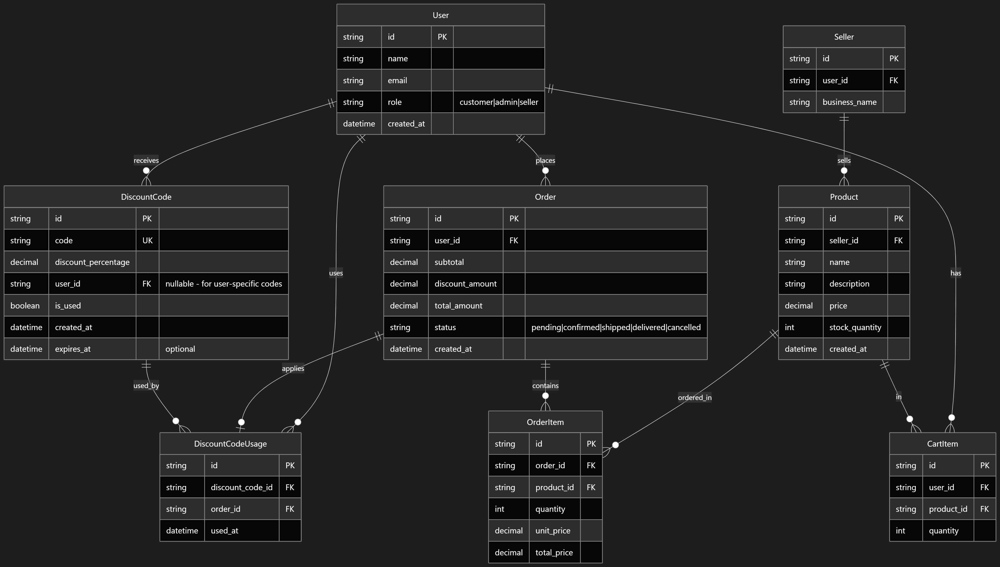

# E-Commerce Backend API Design Plan

## Table of Contents
1. [Refined Understanding](#refined-understanding)
2. [Entity Relationship Diagram](#entity-relationship-diagram)
3. [API Design](#api-design)
   - [Customer APIs](#customer-apis)
   - [Seller APIs](#seller-apis)
   - [Admin APIs](#admin-apis)
4. [In-Memory Data Store Structure](#in-memory-data-store-structure)
5. [Request/Response Structures](#requestresponse-structures)
6. [Implementation Todo List](#implementation-todo-list)

---

## Refined Understanding

Based on the assignment requirements and clarifications, here is the complete understanding:

### User Types
1. **Customer**: Browses products, adds to cart, places orders
2. **Seller**: Manages products, manages order status
3. **Admin**: Views analytics and reports

### Key Business Rules

1. **Cart Management**: Session-based (in-memory), user-specific
2. **Discount System**:
   - Every **n=3** completed orders generates a 10% discount coupon
   - **n value is configurable by seller**
   - Coupon is user-specific (only the qualifying user receives it)
   - Single-use only (once used, it expires)
   - Has expiration date
   - Generated only when order status changes to "completed"
3. **Order Status**: Starts as "pending", only sellers can change status
4. **Authentication**: Simple - request must include `userId` header
5. **Pricing**: Static (product prices don't change)
6. **Reporting**: Per seller and total store revenue

### Entities Required

1. **User**: id, name, email, role (customer/seller/admin)
2. **Product**: id, seller_id, name, description, price, stock_quantity
3. **CartItem**: id, user_id, product_id, quantity
4. **Order**: id, user_id, subtotal, discount_amount, total_amount, status, created_at
5. **OrderItem**: id, order_id, product_id, quantity, unit_price, total_price
6. **DiscountCode**: id, code, discount_percentage, user_id, is_used, created_at, expires_at
7. **DiscountCodeUsage**: id, discount_code_id, order_id, used_at
8. **StoreConfig**: discount_n_value (configurable by admin/seller)

---

## Entity Relationship Diagram



### Entity Descriptions

| Entity | Description |
|--------|-------------|
| **User** | Stores user information with role (customer/seller/admin) |
| **Seller** | Extension of User for seller-specific data |
| **Product** | Items available for sale, linked to sellers |
| **CartItem** | Temporary cart storage (in-memory) |
| **Order** | Completed purchase orders |
| **OrderItem** | Individual items within an order |
| **DiscountCode** | Generated coupons for eligible users |
| **DiscountCodeUsage** | Tracks usage of discount codes |

---

## API Design

### Customer APIs

#### 1. View Products
```
GET /api/products
```
Returns list of all available products with stock.

#### 2. Add Item to Cart
```
POST /api/cart/add
Headers: userId
```
Adds a product to the user's cart.

#### 3. View Cart
```
GET /api/cart
Headers: userId
```
Returns current cart items with totals.

#### 4. Remove from Cart
```
DELETE /api/cart/:productId
Headers: userId
```
Removes item from cart.

#### 5. Checkout
```
POST /api/orders/checkout
Headers: userId
```
Places order with optional discount code.

#### 6. View My Orders
```
GET /api/orders
Headers: userId
```
Returns customer's order history.

#### 7. View My Discount Codes
```
GET /api/discounts
Headers: userId
```
Returns available discount codes for the user.

---

### Seller APIs

#### 1. Create Product
```
POST /api/seller/products
Headers: userId (must be seller)
```
Creates a new product.

#### 2. Update Product
```
PUT /api/seller/products/:productId
Headers: userId (must be seller)
```
Updates product details.

#### 3. Delete Product
```
DELETE /api/seller/products/:productId
Headers: userId (must be seller)
```
Removes a product.

#### 4. View My Products
```
GET /api/seller/products
Headers: userId (must be seller)
```
Returns all products by this seller.

#### 5. View Orders (for my products)
```
GET /api/seller/orders
Headers: userId (must be seller)
```
Returns orders containing seller's products.

#### 6. Update Order Status
```
PUT /api/seller/orders/:orderId/status
Headers: userId (must be seller)
Body: { status: "completed" | "shipped" | "delivered" | "cancelled" }
```
Updates order status. **When status changes to "completed", check if discount code should be generated.**

#### 7. Configure Discount N Value
```
PUT /api/seller/config/discount-n
Headers: userId (must be seller)
Body: { n: number }
```
Configures the "n" value for discount generation (default: 3).

#### 8. View Seller Analytics
```
GET /api/seller/analytics
Headers: userId (must be seller)
```
Returns seller-specific metrics.

---

### Admin APIs

#### 1. Generate Discount Code (Manual)
```
POST /api/admin/discounts/generate
Headers: userId (must be admin)
Body: { userId, discount_percentage, expires_at }
```
Manually generate a discount code for a user.

#### 2. View Store Analytics
```
GET /api/admin/analytics
Headers: userId (must be admin)
Query: ?startDate&endDate (optional)
```
Returns store-wide metrics.

#### 3. List All Discount Codes
```
GET /api/admin/discounts
Headers: userId (must be admin)
```
Returns all discount codes with usage stats.

#### 4. List All Orders
```
GET /api/admin/orders
Headers: userId (must be admin)
```
Returns all orders in the system.

---

## In-Memory Data Store Structure

Since we're using an in-memory store, we'll use JavaScript objects/Maps:

```typescript
// TypeScript interfaces for in-memory store

interface InMemoryStore {
  // Data storage
  users: Map<string, User>;
  products: Map<string, Product>;
  carts: Map<string, CartItem[]>; // userId -> CartItem[]
  orders: Map<string, Order>;
  orderItems: Map<string, OrderItem[]>; // orderId -> OrderItem[]
  discountCodes: Map<string, DiscountCode>;
  discountCodeUsages: Map<string, DiscountCodeUsage>;
  
  // Configuration
  storeConfig: {
    discountNValue: number; // default: 3
  };
  
  // Helper counters for IDs
  counters: {
    user: number;
    product: number;
    order: number;
    discountCode: number;
  };
}

// Data structure examples
const store: InMemoryStore = {
  users: new Map(),
  products: new Map(),
  carts: new Map(),
  orders: new Map(),
  orderItems: new Map(),
  discountCodes: new Map(),
  discountCodeUsages: new Map(),
  storeConfig: {
    discountNValue: 3
  },
  counters: {
    user: 0,
    product: 0,
    order: 0,
    discountCode: 0
  }
};
```

### Entity Interfaces

```typescript
interface User {
  id: string;
  name: string;
  email: string;
  role: 'customer' | 'seller' | 'admin';
  createdAt: Date;
}

interface Product {
  id: string;
  sellerId: string;
  name: string;
  description: string;
  price: number;
  stockQuantity: number;
  createdAt: Date;
}

interface CartItem {
  id: string;
  userId: string;
  productId: string;
  quantity: number;
}

interface Order {
  id: string;
  userId: string;
  subtotal: number;
  discountAmount: number;
  totalAmount: number;
  status: 'pending' | 'confirmed' | 'shipped' | 'delivered' | 'completed' | 'cancelled';
  discountCodeId?: string;
  createdAt: Date;
}

interface OrderItem {
  id: string;
  orderId: string;
  productId: string;
  quantity: number;
  unitPrice: number;
  totalPrice: number;
}

interface DiscountCode {
  id: string;
  code: string;
  discountPercentage: number;
  userId: string;
  isUsed: boolean;
  createdAt: Date;
  expiresAt: Date;
}

interface DiscountCodeUsage {
  id: string;
  discountCodeId: string;
  orderId: string;
  usedAt: Date;
}
```

---

## Request/Response Structures

### Customer APIs

#### POST /api/cart/add
**Request:**
```json
{
  "productId": "prod-001",
  "quantity": 2
}
```

**Response (200 OK):**
```json
{
  "success": true,
  "message": "Item added to cart",
  "cart": {
    "items": [
      {
        "id": "cart-001",
        "productId": "prod-001",
        "productName": "Laptop",
        "quantity": 2,
        "unitPrice": 1000,
        "totalPrice": 2000
      }
    ],
    "totalItems": 2,
    "subtotal": 2000
  }
}
```

#### POST /api/orders/checkout
**Request:**
```json
{
  "discountCode": "DISC10-ABC123" // optional
}
```

**Response (201 Created):**
```json
{
  "success": true,
  "message": "Order placed successfully",
  "order": {
    "id": "order-001",
    "items": [
      {
        "productId": "prod-001",
        "productName": "Laptop",
        "quantity": 2,
        "unitPrice": 1000,
        "totalPrice": 2000
      }
    ],
    "subtotal": 2000,
    "discountAmount": 200,
    "totalAmount": 1800,
    "status": "pending",
    "appliedDiscountCode": "DISC10-ABC123",
    "createdAt": "2026-02-03T10:00:00Z"
  }
}
```

**Response (400 Bad Request - Invalid Discount):**
```json
{
  "success": false,
  "message": "Invalid or expired discount code"
}
```

---

### Seller APIs

#### PUT /api/seller/orders/:orderId/status
**Request:**
```json
{
  "status": "completed"
}
```

**Response (200 OK):**
```json
{
  "success": true,
  "message": "Order status updated to completed",
  "order": {
    "id": "order-001",
    "status": "completed",
    "updatedAt": "2026-02-03T10:30:00Z"
  },
  "discountGenerated": {
    "code": "DISC10-XYZ789",
    "discountPercentage": 10,
    "expiresAt": "2026-03-03T10:30:00Z"
  }
}
```

*Note: When order status becomes "completed" and user has 3, 6, 9... completed orders, a discount code is auto-generated.*

#### GET /api/seller/analytics
**Response (200 OK):**
```json
{
  "success": true,
  "data": {
    "totalProducts": 10,
    "totalOrders": 25,
    "totalItemsSold": 50,
    "totalRevenue": 45000,
    "averageOrderValue": 1800,
    "discountCodesGenerated": 8,
    "totalDiscountAmount": 1200
  }
}
```

---

### Admin APIs

#### GET /api/admin/analytics
**Response (200 OK):**
```json
{
  "success": true,
  "data": {
    "storeWide": {
      "totalCustomers": 50,
      "totalSellers": 5,
      "totalProducts": 100,
      "totalOrders": 200,
      "totalItemsPurchased": 450,
      "totalRevenue": 180000,
      "totalDiscountCodes": 40,
      "totalDiscountsGiven": 8000
    },
    "perSeller": [
      {
        "sellerId": "seller-001",
        "sellerName": "Tech Store",
        "productsCount": 20,
        "ordersCount": 50,
        "itemsSold": 100,
        "revenue": 50000
      }
    ]
  }
}
```

---

## Implementation Todo List

### Phase 1: Project Setup
- [ ] Initialize Node.js project with Express
- [ ] Set up TypeScript configuration
- [ ] Create project structure (routes, controllers, models, middleware)
- [ ] Create in-memory data store

### Phase 2: Core Entities & Middleware
- [ ] Create User entity with roles
- [ ] Create Product entity
- [ ] Create authentication middleware (check userId header)
- [ ] Create role-based access control middleware
- [ ] Create validation middleware

### Phase 3: Customer APIs
- [ ] GET /api/products - List products
- [ ] POST /api/cart/add - Add to cart
- [ ] GET /api/cart - View cart
- [ ] DELETE /api/cart/:productId - Remove from cart
- [ ] POST /api/orders/checkout - Checkout with discount validation
- [ ] GET /api/orders - View my orders
- [ ] GET /api/discounts - View my discount codes

### Phase 4: Seller APIs
- [ ] POST /api/seller/products - Create product
- [ ] PUT /api/seller/products/:productId - Update product
- [ ] DELETE /api/seller/products/:productId - Delete product
- [ ] GET /api/seller/products - View my products
- [ ] GET /api/seller/orders - View orders for my products
- [ ] PUT /api/seller/orders/:orderId/status - Update order status
- [ ] PUT /api/seller/config/discount-n - Configure discount N value
- [ ] GET /api/seller/analytics - View seller analytics

### Phase 5: Admin APIs
- [ ] POST /api/admin/discounts/generate - Manual discount generation
- [ ] GET /api/admin/analytics - Store-wide analytics
- [ ] GET /api/admin/discounts - List all discount codes
- [ ] GET /api/admin/orders - List all orders

### Phase 6: Discount System Logic
- [ ] Implement discount code generation logic
- [ ] Track completed orders per user
- [ ] Auto-generate discount on nth completed order
- [ ] Validate discount codes at checkout
- [ ] Mark discount codes as used after checkout
- [ ] Handle discount code expiration

### Phase 7: Testing & Documentation
- [ ] Test all APIs with sample data
- [ ] Document API endpoints
- [ ] Create sample requests/responses
- [ ] Verify discount system works correctly

---

## Key Implementation Notes

### Discount Code Generation Algorithm
```typescript
function onOrderStatusChangeToCompleted(order: Order) {
  const userId = order.userId;
  const completedOrders = countCompletedOrders(userId);
  const n = store.storeConfig.discountNValue;
  
  if (completedOrders % n === 0) {
    const discountCode = generateDiscountCode(userId, 10);
    // Associate with user
  }
}
```

### Cart to Order Flow
1. Validate cart is not empty
2. Validate all products have sufficient stock
3. Validate discount code (if provided)
4. Calculate totals (subtotal, discount, final total)
5. Deduct stock from products
6. Create Order and OrderItems
7. Clear cart
8. Return order confirmation

### In-Memory Persistence Strategy
Since we're using in-memory storage:
- Data will be lost on server restart
- For development/testing, we can seed initial data
- Each entity should have auto-incrementing IDs
- Use Map for O(1) lookups by ID
